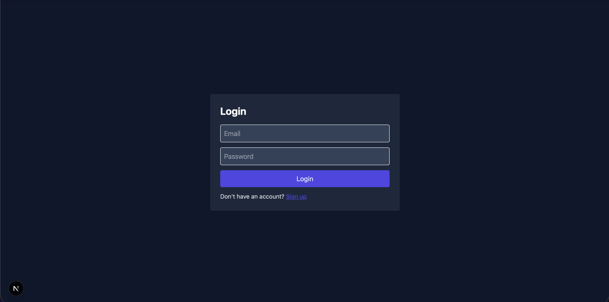
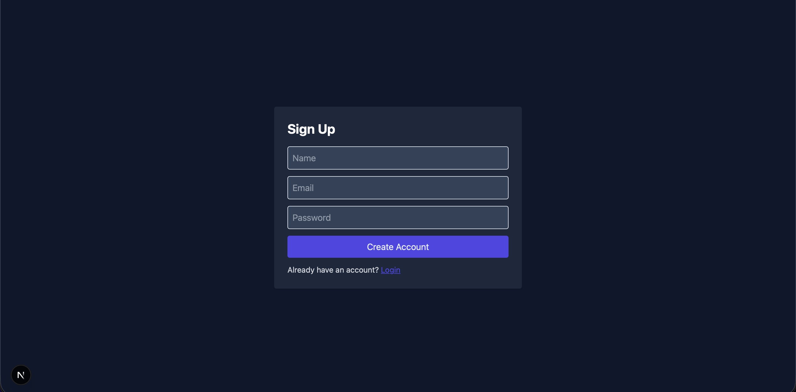
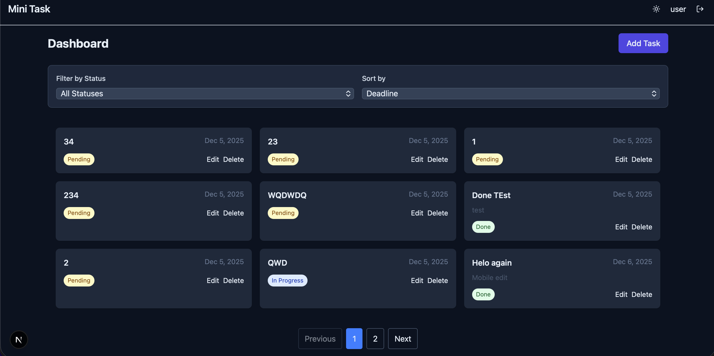
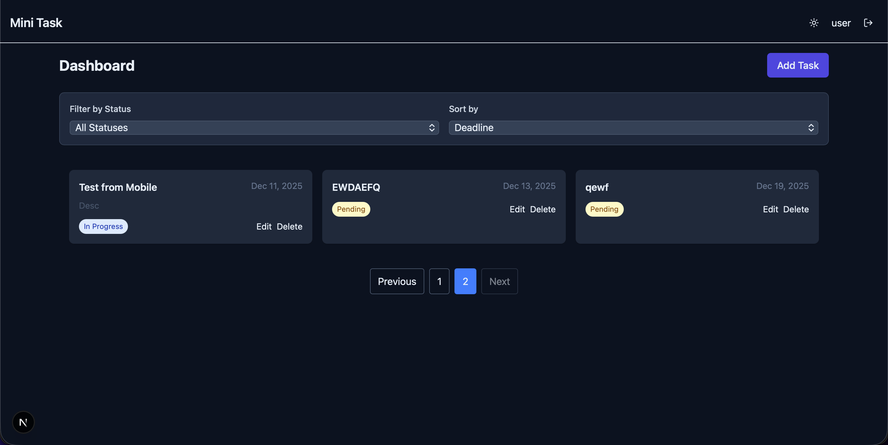
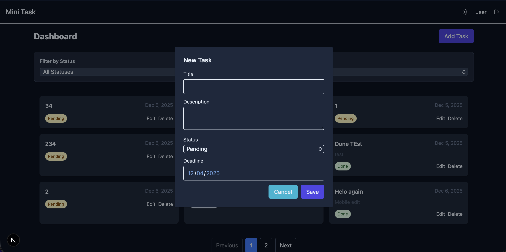
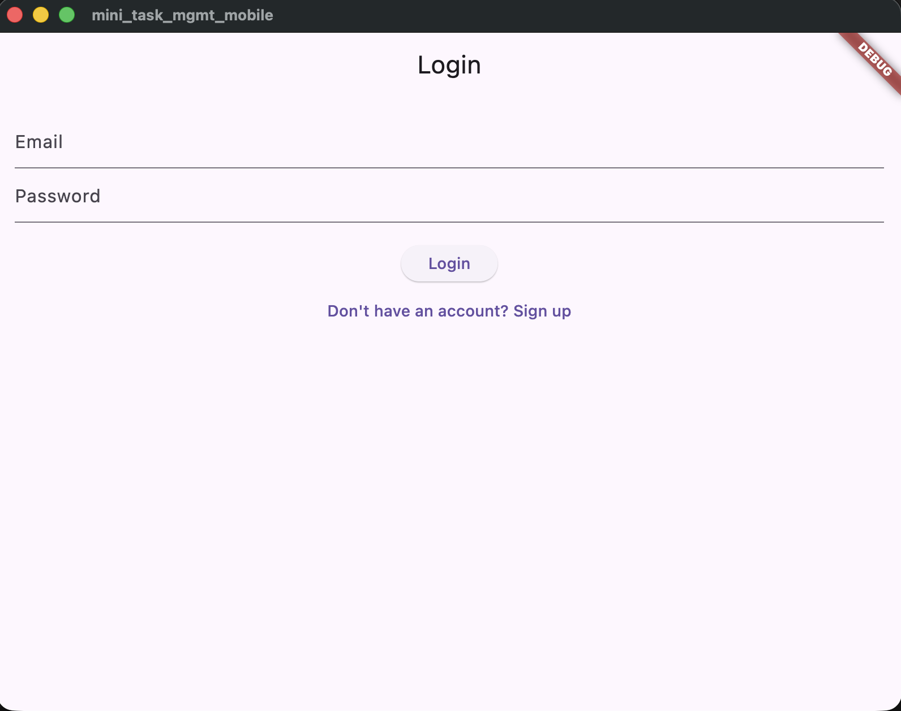
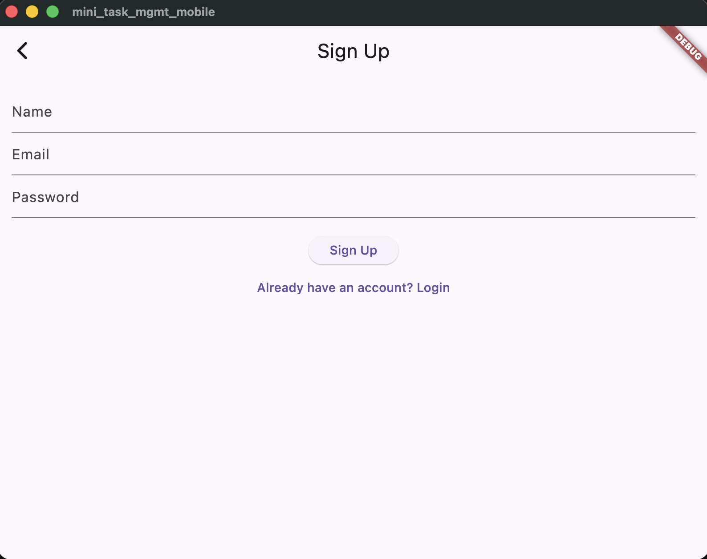
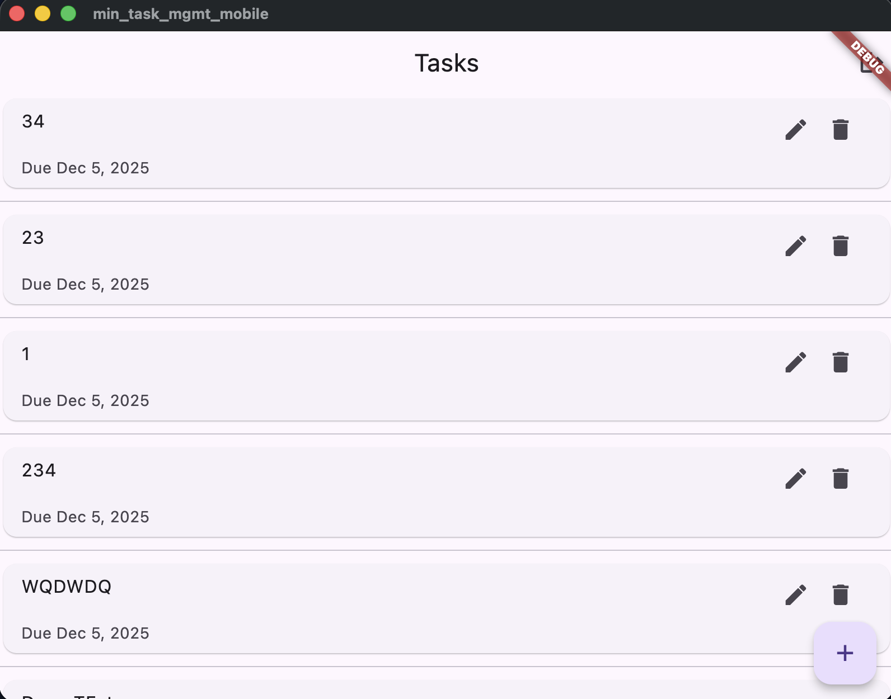
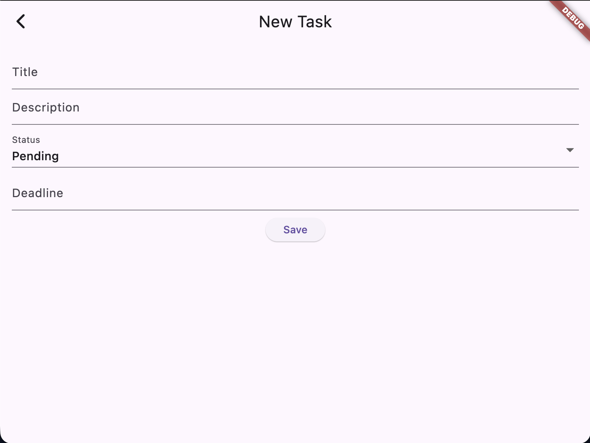

# Mini Task Management

A minimal full-stack task management application with three components:

- **Backend**: Node.js + Express + MongoDB. JWT-based authentication and REST API for user-scoped tasks.
- **Frontend**: Next.js + React + Tailwind CSS. Web client with authentication, task CRUD, filtering, and dark mode.
- **Mobile**: Flutter app (Provider). Mobile client with authentication and task management.

Features

- Email/password signup & login (JWT)
- User-scoped task CRUD (title, description, status, deadline)
- Filtering and sorting (status, deadline range)
- Dark mode support (web)
- Mobile client for Android/iOS

Getting started (high level)

1. Backend

   - cd `backend`
   - `npm install`
   - Copy `.env.example` to `.env` and set `MONGODB_URI` and `JWT_SECRET`
   - `npm run dev`

2. Frontend

   - cd `frontend`
   - `npm install`
   - Copy `.env.example` to `.env.local` and set `NEXT_PUBLIC_API_URL`
   - `npm run dev`

3. Mobile

   - cd `mobile`
   - `flutter pub get`
   - Configure `lib/config/constants.dart` for your emulator/device
   - `flutter run`

See the READMEs inside each folder for more detailed instructions and API docs.

Screenshots

## Web App:

### Homepage

### Login

### Sign Up

### User Dashboard

### Pagination

### New Task

## Mobile

### Login

### Sign Up

### User Dashboard

### New Task

Recording

## Demo

[Video Demo (Click Here)](screenshots/demo.mov)

<!-- <video width="320" height="240" controls>
  <source src="screenshots/demo.mov" type="video/mp4">
</video> -->

# Mini Task Management

Full-stack minimal task management application with three components:

- Backend: Node.js + Express + MongoDB (JWT auth)
- Frontend: Next.js + Tailwind CSS
- Mobile: Flutter app (Provider state management)

See each subdirectory for setup instructions.
